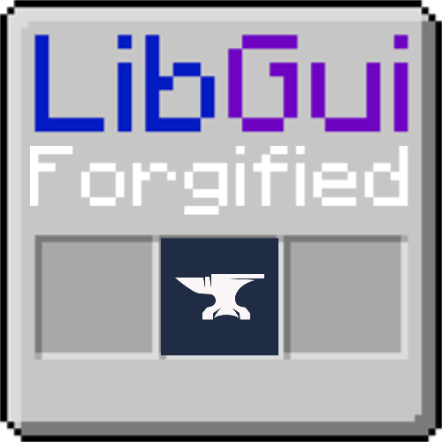

# LibGuiForgified

LibGui unofficial Forge port.

Minecraft GUIs without spending forever painstakingly aligning things to the background image.
Instead, LibGui takes a logical description of your GUI, and draws it on-the-fly like any modern
GUI system. Controls can be hung on an itemslot grid or offset from it. Panel styles, colors,
and opacity can be customized, and everything can be extended.

## Dev Setup

This is how to get LibGuiForgified into your development environment:

1. Add the Github repository:
```groovy
repositories {
    maven { url "https://raw.githubusercontent.com/peaksuperior885/peaks_maven/main/files/" }
}
```
> Note: This is not the same repositories as the one in publishing! 
> You have to add the repository to a top-level repositories block.

2. Add the dependency, replacing 0.1.3 with your desired LibGuiForgified version:
```groovy
dependencies {
     implementation 'com.peak885:LibGuiForgified:0.1.3+1.21.1'
}
```
The include makes Loom bundle LibGuiForgified within your mod jar.

## Docs
See the [LibGui wiki](https://github.com/CottonMC/LibGui/wiki)

And for code examples:
* [Client-Only Guis](https://github.com/CottonMC/LibGui/wiki/Client-Sided-Guis) 
* [Inventory Guis](https://github.com/CottonMC/LibGui/wiki/Getting-Started-with-GUIs)
